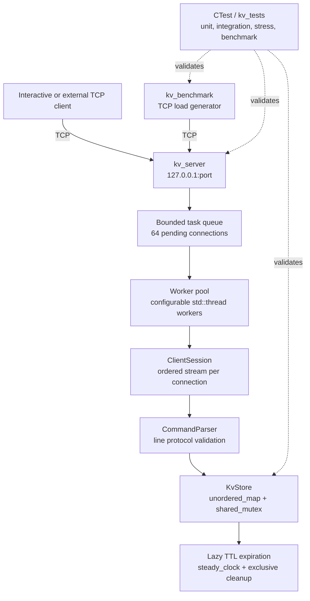

# Multithreaded In-Memory Key-Value Server

A Redis-inspired C++17 TCP server built to explore networking, concurrency, synchronization, and reproducible performance measurement.

[](https://isocpp.org/)
[](https://cmake.org/)
[](https://learn.microsoft.com/windows/wsl/)
[](https://en.cppreference.com/w/cpp/thread)
[](https://man7.org/linux/man-pages/man7/tcp.7.html)
[](https://cmake.org/cmake/help/latest/manual/ctest.1.html)
[](#phase-3-load-generation-and-benchmarking)

## Overview

This is a custom in-memory key-value server with a small line-oriented TCP protocol. It is inspired by Redis-style systems, but it is not Redis-compatible and does not implement RESP, persistence, replication, authentication, or clustering.

The server accepts TCP connections on `127.0.0.1`, assigns each connection to a bounded worker pool, parses commands, and stores values in a shared `std::unordered_map`. The storage layer supports lazy TTL expiration. Commands on one connection remain ordered, while different connections can execute concurrently.

The repository also contains `kv_client`, an interactive TCP client; `kv_tests`, which covers unit, TCP, concurrency, stress, and benchmark behavior; and `kv_benchmark`, a standalone TCP load generator that measures the actual server path.

## Why I Built This

This project is a focused systems-programming exercise in building and measuring a networked service. It brings together POSIX sockets, request framing, connection ownership, thread pools, producer-consumer synchronization, shared storage, TTL semantics, graceful shutdown, automated testing, and latency analysis in one small codebase.

The goal is not to recreate Redis. The goal is to make the important systems decisions visible, testable, and understandable to another C++ developer.

## Architecture



The server owns the listener and accepted descriptors. A worker owns one client connection for its complete session, which preserves per-connection ordering. The parser and storage layers are deliberately separate from socket handling, while the benchmark remains a separate executable and never calls `KvStore` directly.

```text
Clients
   |
   v
TCP Server / accept loop
   |
   v
Bounded socket-task queue (64 pending tasks)
   |
   v
Worker pool (configurable, no detached threads)
   |
   v
ClientSession (one complete ordered stream per worker task)
   |
   v
CommandParser --> thread-safe KvStore --> lazy TTL
```

The accept loop owns newly accepted descriptors until a task is successfully submitted. A worker then owns one descriptor for the entire client session and closes it through RAII. This means commands from one connection stay sequential and ordered, while different connections execute concurrently.

## Project History

- **Phase 1:** POSIX TCP networking, line parsing, storage abstraction, defensive limits, the interactive client, sequential behavior, and basic tests.
- **Phase 2:** configurable worker pool, bounded queue, concurrent client handling, synchronized storage, TTL, pipelining, graceful shutdown, integration tests, and stress tests.
- **Phase 3:** standalone TCP load generation, configurable workloads and pipeline depth, warmup, latency percentiles, CSV reporting, Release matrix automation, and measured performance documentation.

## Commands

- `PING` returns `PONG`.
- `SET <key> <value>` stores a persistent value. Values may contain spaces.
- `SET <key> <value> <ttl_seconds>` stores a value with a non-negative TTL.
- `GET <key>` returns the value or `(nil)`.
- `DEL <key>` returns `(integer) 1` or `(integer) 0`.
- `HELP` lists commands.
- `QUIT` returns `BYE` and closes the connection.

Because the protocol preserves values containing spaces, a final numeric token is interpreted as the optional TTL. For example, `SET session Rupdip 10` expires after ten seconds, while `SET message hello world` stores `hello world`. TTL `0` expires immediately; negative, overflowing, and values above ten years are rejected. A non-numeric final token remains part of a space-containing value because the line protocol cannot otherwise distinguish it from ordinary value text. Expiration is lazy: `GET` and `DEL` remove expired entries when they encounter them.

## Request Lifecycle

```text
client -> TCP connection -> accept loop -> worker task -> ClientSession
   -> CommandParser -> KvStore -> newline response -> client
```

`PING` returns `PONG`; `SET` stores a value and returns `OK`; `GET` returns a value or `(nil)`; `DEL` returns `(integer) 1` or `(integer) 0`; `HELP` lists commands; and `QUIT` returns `BYE` before closing the session. The server handles partial reads, multiple commands in one read, CRLF input, and ordered pipelined responses.

Example:

```text
> SET name Rupdip
OK
> SET age 22
OK
> GET name
Rupdip
> SET session Rupdip 10
OK
> GET session
Rupdip
> DEL name
(integer) 1
```

## Build

```sh
cmake -S . -B build
cmake --build build -- -j2
```

For optimized performance measurements, use a separate Release tree:

```sh
cmake -S . -B build-release -DCMAKE_BUILD_TYPE=Release
cmake --build build-release -- -j2
```

For a clean rebuild:

```sh
rm -rf build-final
cmake -S . -B build-final
cmake --build build-final -- -j2
```

The project requires CMake 3.16 or newer, a C++17 compiler, POSIX socket APIs, and pthread support. Project targets use `-Wall -Wextra -Wpedantic`.

## Run the Server and Client

Start the server on `127.0.0.1:6380`:

```sh
./build/kv_server
./build/kv_server 6380 4
```

The second form selects four workers. The default is `std::thread::hardware_concurrency()` with a fallback of four; valid configured values are 1 through 256. Connect with the interactive client:

```sh
./build/kv_client
./build/kv_client 127.0.0.1 6380
```

## Concurrency and shutdown

The queue is protected by a mutex and condition variable. It accepts at most 64 waiting socket tasks; a full queue receives `(error) server busy` and the connection is closed. Workers drain queued tasks during shutdown, and active sessions use a receive timeout to observe SIGINT and exit. All worker threads are joined.

`KvStore` uses a `std::shared_mutex` to protect its `std::unordered_map`. Writes use exclusive locking. Reads also use an exclusive lock because lazy expiration may erase an expired entry; this keeps the expiration check and deletion atomic and understandable.

The storage map is `mutable` so the logically const `get` operation can perform this lock-protected lazy cleanup without `const_cast`. The initial CMake build exposed this constness requirement; parser command aggregates were also made explicit to eliminate `-Wmissing-field-initializers` warnings.

Pipelined commands are buffered until newline boundaries. Multiple complete commands in one TCP read and commands split across reads are both supported. Responses are emitted in the same order for each connection. CRLF input is accepted.

## Key Engineering Concepts

| Concept | Where Used | Why It Matters |
|---|---|---|
| TCP sockets | `Server`, `ClientSession`, `kv_client`, `kv_benchmark` | Provides the real request and response path. |
| Client/server architecture | `kv_server` and client executables | Separates connection ownership from command execution. |
| Multithreading | Worker pool and benchmark clients | Allows concurrent sessions and controlled load generation. |
| Thread pool | `ThreadPool` | Reuses bounded workers instead of creating one thread per request. |
| Synchronization | Queue mutex, condition variable, storage `shared_mutex` | Prevents races around tasks and shared values. |
| Hash map | `KvStore::values_` | Gives average constant-time key lookup for this workload. |
| TTL / lazy expiration | `KvStore`, `steady_clock` | Expires values without a background expiration thread. |
| C++ RAII | Socket guards and worker ownership | Makes descriptor and thread cleanup explicit. |
| CMake | Root build configuration | Defines reusable library and executable targets. |
| CTest | Four registered test modes | Automates unit, TCP, stress, and benchmark validation. |
| Benchmarking | `kv_benchmark` and matrix script | Measures the complete networked system. |
| Percentile latency | Sorted benchmark samples | Shows tail behavior through p50, p95, and p99. |

## Explore the Code

| Path | Responsibility |
|---|---|
| `include/` | Public interfaces for storage, parsing, sessions, server, and worker pool. |
| `src/kv_store.cpp` | Thread-safe map operations and lazy TTL cleanup. |
| `src/command_parser.cpp` | Line protocol tokenization and validation. |
| `src/client_session.cpp` | TCP buffering, command execution, and response writing. |
| `src/server.cpp` | Listener lifecycle, accept loop, task submission, and shutdown. |
| `src/thread_pool.cpp` | Bounded producer-consumer worker pool. |
| `benchmarks/benchmark_main.cpp` | Standalone TCP load generation and latency reporting. |
| `tests/test_main.cpp` | Unit, integration, stress, and benchmark test modes. |
| `scripts/run_benchmarks.sh` | Release matrix orchestration and cleanup. |
| `docs/architecture.md` | Detailed ownership, concurrency, storage, and benchmark notes. |

Lines are limited to 4096 bytes, keys to 256 bytes, values to 2048 bytes, and pending queue tasks to 64. The server is local and uses IPv4 POSIX sockets; it does not provide authentication, persistence, clustering, epoll, asynchronous I/O, or protocol framing such as RESP.

## Tests and sanitizer build

CTest includes:

- unit tests for storage, TTL, parser edge cases, and the worker pool;
- real TCP integration tests for pipelining, partial reads, CRLF, TTL, reconnects, shutdown, and concurrent clients;
- a 20-client, 100-operation-per-client stress test.

For GCC or Clang, an optional ThreadSanitizer build is available:

```sh
cmake -S . -B build-tsan -DENABLE_THREAD_SANITIZER=ON
cmake --build build-tsan
ctest --test-dir build-tsan --output-on-failure
```

## Phase 3: load generation and benchmarking

Phase 3 adds `kv_benchmark`, a separate C++17 executable that exercises the actual TCP server. It never calls `KvStore` directly. Each benchmark client owns one persistent TCP connection and one thread, so the path measured is:

```text
kv_benchmark client threads -> TCP -> kv_server -> worker pool
      -> ClientSession -> CommandParser -> KvStore -> TCP response
```

The benchmark validates every response before counting a request as successful. It distinguishes connection, send, receive, malformed-response, unexpected-response, and timeout failures. A benchmark process exits nonzero when measured requests fail.

### Benchmark CLI

Run `./build-release/kv_benchmark --help` for the complete option list. Defaults are:

| Option | Default | Meaning |
|---|---:|---|
| `--host` | `127.0.0.1` | Server host |
| `--port` | `6380` | Server port |
| `--clients` | `1` | Concurrent TCP connections/threads |
| `--requests` | `10000` | Total fixed-count measurement requests |
| `--pipeline` | `1` | Commands sent before reading responses |
| `--workload` | `mixed` | 70% GET, 20% SET, 10% DEL |
| `--key-space` | `1000` | Reusable key count |
| `--value-size` | `16` | Generated value bytes |
| `--warmup` | `0` | Warmup seconds, excluded from results |
| `--duration` | disabled | Duration-mode measurement seconds; takes precedence over requests |
| `--seed` | `42` | Deterministic workload seed |
| `--timeout` | `2000` | Socket timeout in milliseconds |

Supported workloads are `set-heavy` (80% SET/20% GET), `get-heavy` (90% GET/10% SET), `mixed` (70% GET/20% SET/10% DEL), `set-get` (50% each), and `set-get-del` (70% GET/20% SET/10% DEL). Keys are reused from the configured key space so GET and DEL are meaningful. Values are generated with nonnumeric content to avoid the protocol's final-numeric-token TTL rule.

Pipeline depth 1 performs request/response synchronously. Larger depths send a batch and then read the same number of newline-delimited responses in order. The benchmark records batch send-to-response-completion latency for each validated response in that batch; this is intentionally reported in the output rather than presented as independent server service time.

The report includes total, successful, and failed requests, throughput, minimum, average, p50, p95, p99, and maximum latency in microseconds and milliseconds. Percentiles use the nearest-rank method after sorting: percentile `p` is sample `ceil(p * N)`. Warmup uses separate connections and does not contribute samples or measured failures.

For machine-readable output:

```sh
./build-release/kv_benchmark --host 127.0.0.1 --port 6380 \
   --clients 10 --requests 10000 --pipeline 4 --workload set-get-del \
   --warmup 2 --format csv --output benchmarks/results/run.csv
```

The server worker count is configured when starting the server, not inside the benchmark:

```sh
./build-release/kv_server 6380 4
```

`--server-workers` and `--build-type` are optional report metadata fields. The benchmark is client-side and localhost results include TCP, scheduling, queueing, parsing, locking, and response transmission. They should not be compared with a remote or Debug run without recording those conditions.

### Reproducible benchmark matrix

Use the repository runner after building the project:

```sh
bash scripts/run_benchmarks.sh
```

It creates `build-release` with `CMAKE_BUILD_TYPE=Release`, starts a server with one and four workers, and runs mixed workloads for 1/8/16 clients and pipeline depths 1/4. Each configuration writes a CSV under `benchmarks/results/`; generated CSV and log files are ignored by Git. Override `REQUESTS`, `WARMUP`, `PORT_BASE`, `BUILD_DIR`, or `RESULTS_DIR` as environment variables. The script only signals the exact server PIDs it started.

Performance measurements should use Release while correctness tests may use the normal build:

```sh
cmake -S . -B build-release -DCMAKE_BUILD_TYPE=Release
cmake --build build-release -- -j2
ctest --test-dir build-release --output-on-failure
```

### Benchmark results

The following results were measured on 2026-08-20 in WSL Ubuntu, on the same machine as the server, with GCC 15.2.0, a CMake Release build, key space 1000, value size 16 bytes, warmup 0 seconds, 200 requests per row, and a 30-second per-run timeout. The server used the worker count shown; the benchmark used localhost TCP and the `mixed` distribution (70% GET, 20% SET, 10% DEL). Every row completed all 200 requests with zero failures.

| Workers | Clients | Pipeline | Requests | Throughput req/s | Avg us | P50 us | P95 us | P99 us |
|---:|---:|---:|---:|---:|---:|---:|---:|---:|
| 1 | 1 | 1 | 200 | 3317.94 | 293.936 | 277.543 | 528.867 | 662.712 |
| 1 | 1 | 4 | 200 | 92.7587 | 21580.2 | 900.345 | 44441 | 44648.1 |
| 1 | 8 | 1 | 200 | 2880.94 | 1474.57 | 312.177 | 580.032 | 40056.4 |
| 1 | 8 | 4 | 200 | 113.624 | 142109 | 43239 | 1098940 | 1539070 |
| 1 | 16 | 1 | 200 | 2783.88 | 3128.61 | 287.858 | 23583 | 59342.5 |
| 1 | 16 | 4 | 200 | 142.012 | 228360 | 43439.2 | 1143750 | 1319960 |
| 4 | 1 | 1 | 200 | 4378.76 | 221.969 | 193.188 | 508.936 | 605.16 |
| 4 | 1 | 4 | 200 | 92.8025 | 21696.1 | 835.011 | 44395.9 | 44602.4 |
| 4 | 8 | 1 | 200 | 19717.2 | 288.997 | 156.582 | 416.236 | 5435.57 |
| 4 | 8 | 4 | 200 | 448.543 | 36265.2 | 950.57 | 221343 | 221964 |
| 4 | 16 | 1 | 200 | 17111.1 | 481.673 | 203.693 | 2918.84 | 7585.9 |
| 4 | 16 | 4 | 200 | 503.68 | 65162.3 | 43398.4 | 265531 | 309276 |

The observed comparison is not a general performance claim: this was a short localhost matrix with only 200 requests per configuration. In this run, pipeline depth 4 produced much lower throughput and much higher tail latency than pipeline depth 1. That is an observed result of this implementation and test setup, not an assumed property of pipelining. The likely contributing mechanism is the server's one-worker-per-complete-connection model combined with the benchmark's batch completion latency; longer batches keep each connection's worker occupied and amplify the measured batch latency. This is a hypothesis about mechanism, while the numbers themselves are measured.

### Development Problems and Fixes

- The initial Windows environment lacked the CMake/compiler setup needed for this POSIX project. WSL Ubuntu was selected and configured with GCC, CMake, and Git.
- CMake configuration on a Windows-mounted path failed with `Operation not permitted`. Moving the project to `/home/dell/projects/redis` showed how Linux tooling and filesystem semantics affect native builds.
- Phase 2 exposed a const-correctness error in `KvStore::get()`: lazy TTL cleanup needs to erase an expired value while the public operation remains const. Declaring the map mutable and keeping the exclusive lock preserved the API without `const_cast`.
- Strict compilation reported missing-field-initializer warnings in the command parser. Explicit aggregate initialization removed them and made parser intent clearer.
- Phase 3 could not create `benchmarks/results` on the mounted workspace because of the WSL filesystem permission behavior. Matrix output was redirected to `/tmp/kv-benchmark-results`, supported by the runner's configurable `RESULTS_DIR`.
- Embedded Bash commands passed through PowerShell were altered by variable expansion and shell syntax rewriting. Safe single-quoted WSL commands and direct bounded file reads avoided that problem.
- An unbounded diagnostic shell loop became stuck while inspecting generated files. It was stopped and replaced with bounded `sed`, `find`, and explicit CSV parsing commands.
- The first matrix runner stopped after the four one-worker rows: its server-transition lifecycle had a fixed reused port, no explicit readiness/benchmark timeout, and no diagnostic boundary when the `set -e` path exited. The server log proved the first server had stopped, no second-server log existed, and no process remained. The runner was fixed to use per-worker ports, captured PIDs, bounded readiness and benchmark timeouts, explicit startup/failure messages, and unconditional cleanup.

These incidents reinforced the value of building in the target environment, treating warnings as design feedback, and validating concurrency changes with real TCP tests before measuring performance.

### Concepts demonstrated

This project applies C++ classes, RAII socket ownership, const correctness, `mutable`, STL hash maps, `std::thread`, mutexes, `condition_variable`, `shared_mutex`, `chrono`, exceptions at process boundaries, and CMake. Its networking path uses TCP sockets, `bind`, `listen`, `accept`, `connect`, partial `send`/`recv`, newline buffering, and explicit connection lifecycle handling. Its concurrency model is a bounded producer/consumer worker pool with per-connection ordering and synchronization around shared storage. TTL uses monotonic time and lazy expiration. Phase 3 adds throughput, latency distributions, nearest-rank percentiles, warmup, workload design, scaling dimensions, response validation, and reproducible CSV reporting. Unit, integration, concurrent, stress, and benchmark tests cover different correctness boundaries.

### Design tradeoffs and limitations

The server uses a worker pool because one worker per request would create excessive thread and ordering overhead. One task owns a complete connection, which preserves pipeline order but means an idle connection occupies a worker. The bounded queue provides backpressure, while its fixed size and listen backlog limit connection bursts. `shared_mutex` protects the map, but `GET` takes an exclusive lock because lazy deletion is part of the read path. `steady_clock` avoids wall-clock adjustments, and lazy TTL avoids a background expiration thread at the cost of stale expired entries until GET or DEL sees them.

The line protocol is intentionally small and does not provide RESP, authentication, TLS, persistence, replication, eviction, clustering, or distributed benchmarking. Storage is single-process and memory-only. Values, keys, request lines, and the benchmark's value size are bounded. Localhost runs reduce network noise but can hide network, NUMA, and distributed contention; the load generator itself can also become the bottleneck at high client counts. These are scope boundaries, not claims of production Redis equivalence. Redis is the inspiration for the command vocabulary and in-memory request/response shape, while this project focuses on learning systems implementation and measurement.

### Future improvements

Possible next steps are a reusable protocol client library, asynchronous load generation, richer latency histograms, JSON output, server-side counters, eviction policies, RESP framing, persistence, authentication, TLS, and distributed benchmark workers. They are deliberately outside the current Phase 3 implementation.
